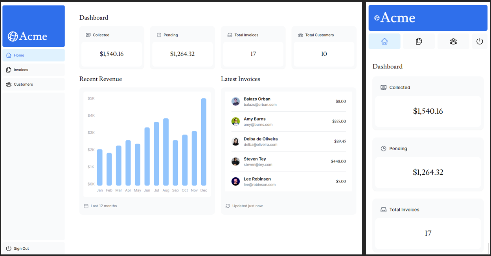
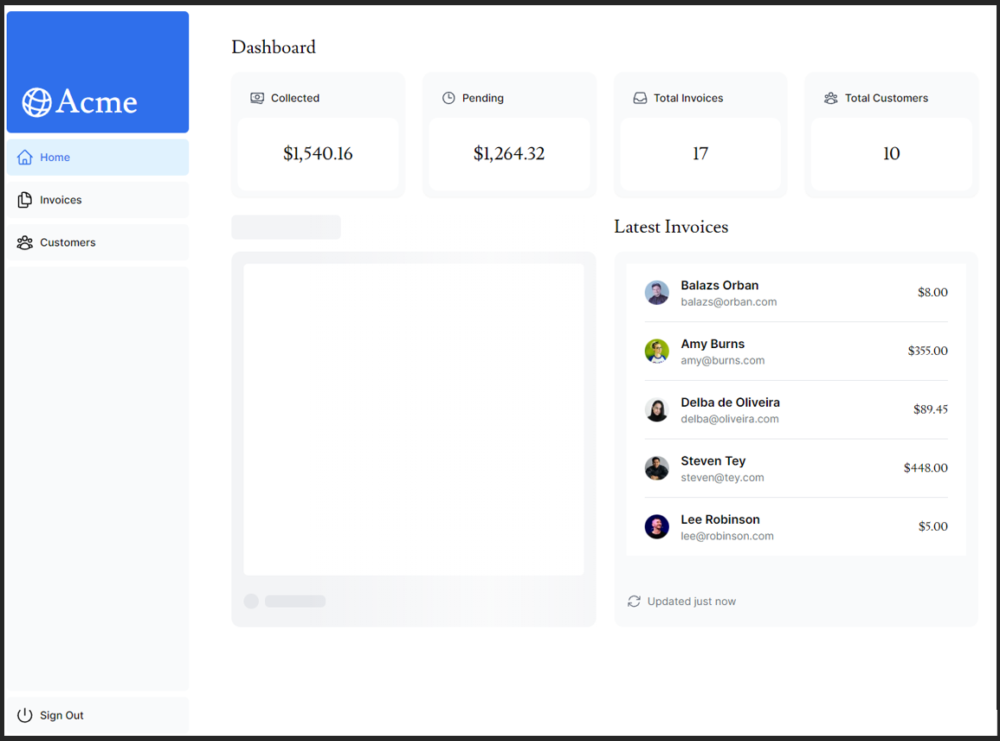
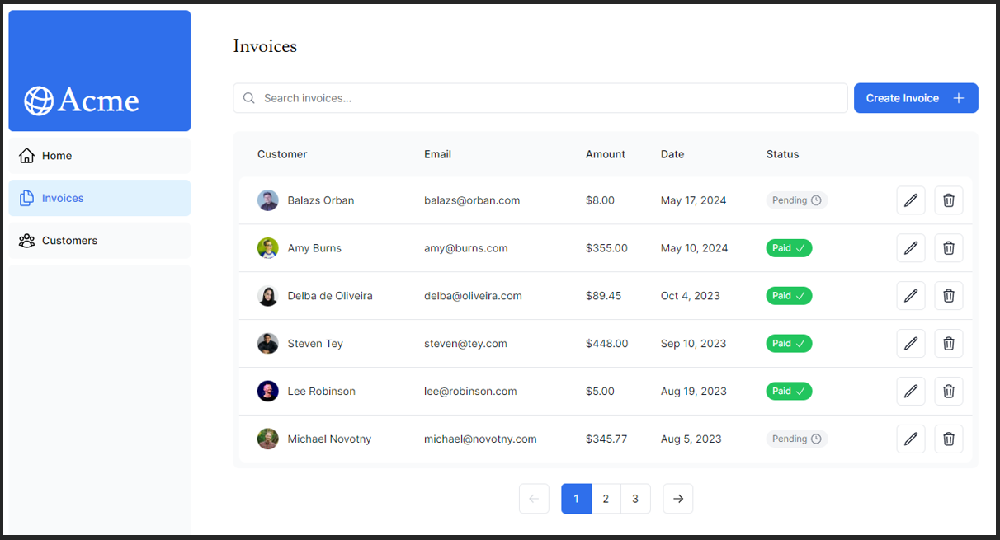

# FullStack Projektiraportti 3

## Sisällysluettelo
1. [Yleistä tietoa projektista](#yleistä-tietoa-projektista)
2. [Käytettyjä tekniikoita ja erikoisuuksia](#käytettyjä-tekniikoita-ja-erikoisuuksia)
   - [Next.js / Vercel](#nextjs--vercel)
   - [Muut palikat](#muut-palikat)
3. [Sivuston / ohjelmiston design ja rakenne](#sivuston--ohjelmiston-design-ja-rakenne)
4. [Oma arvio työstä ja oman osaamisen kehittymisestä](#oma-arvio-työstä-ja-oman-osaamisen-kehittymisestä)
5. [Palaute opettajalle kurssista sekä itse opetuksesta tähän saakka](#palaute-opettajalle-kurssista-sekä-itse-opetuksesta-tähän-saakka)
6. [Linkit](#linkit)
7. [Lähteet](#lähteet)

## Yleistä tietoa projektista
FullStack-kurssin kolmannen projektin aiheena oli rakentaa full-stack sovellus Next.js-frameworkkiä ja heidän virallista tutoriaalia käyttäen. Tavoitteena oli rakentaa sovellus yrityksen kirjanpitoa varten.

## Käytettyjä tekniikoita ja erikoisuuksia
### Next.js / Vercel
Projektin 'sydämenä' toimii Vercelin Next.js framework ja TypeScript. Next.js huolehtii front- ja backendistä, serveri- ja sivurakenteesta, tietokannasta, autentikoinnista ja auktorisoinnista sekä verkkosivuston hostaamisesta. Reitityksessä on käytetty Next.js:n uutta App Routeria, server-komponentteja, esirenderöintiä ja hydraatiota. Skeleton-näkymä esitetään komponenteille, jotka eivät ole vielä latautuneet.

### Muut palikat
- **Tailwind CSS**: CSS-design
- **CLSX**: Konditionaaliset classNamet
- **Bcrypt**: Salasanojen salaus
- **Zod**: Lomakkeiden datan validointi

## Sivuston / ohjelmiston design ja rakenne
Projektissa on responsiivinen dashboard-näkymä, jossa jokainen komponentti latautuu itsenäisesti. Skeleton-näkymä näytetään latautumattomille komponenteille.

*Desktop- ja mobiiliversioiden etusivu*

*Latautumattoman taulukon skeleton*

*Invoices-välilehti*

Projektissa käsiteltiin myös metadatan hallinnointia, datan validointia ja autentikointia Next-authin avulla. Auktorisointi jäi vähäiseksi, ja suurin osa reiteistä on blokattu, jos käyttäjä ei ole kirjautunut.

**Kirjautumistunnukset:**
- **Email**: user@nextmail.com
- **Salasana**: 123456

## Oma arvio työstä ja oman osaamisen kehittymisestä
Onnistuin projektissa erinomaisesti. Vercelin tutoriaali oli kattava ja helposti lähestyttävä. Kohtasin vain muutamia pieniä ongelmia, jotka ratkoin oma-aloitteisesti.

## Palaute opettajalle kurssista sekä itse opetuksesta tähän saakka
Kurssi on ollut monipuolinen ja mahdollisuus osallistua etänä on ollut arvokasta. Tarvittavat tekniikat on esitelty riittävällä tasolla ja kurssi kannustaa omatoimiseen opiskeluun.

## Linkit
- **Verkkosivun osoite**: [Next.js Dashboard](https://nextjs-dashboard-beige-alpha-69.vercel.app/)
- **GitHub Repository**: [nextjs-dashboard](https://github.com/MrYawnie/nextjs-dashboard/)
- **Projektin videoesitys**: [YouTube Video](https://youtu.be/oUdiDJMHdeo)

## Lähteet
- [Next.js: Learn Next.js](https://nextjs.org/) (2024)
- [Next.js: The React Framework for the Web](https://nextjs.org/) (2024)
